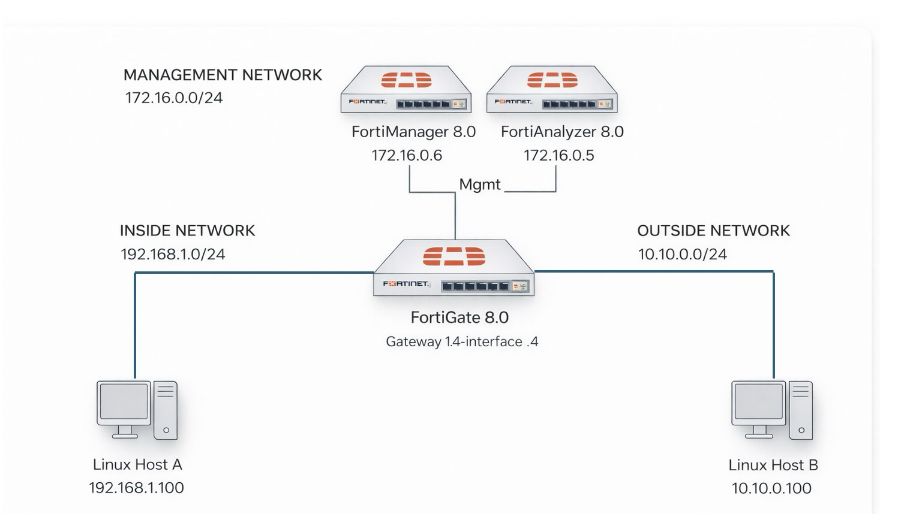

# Network Topology

The active workshop path (Labs 1–5) uses a **FortiGate** running FortiOS 8.0 and **Linux Host A** as the inside-network traffic generator. **FortiManager**, **FortiAnalyzer**, and **Linux Host B** appear in the diagram for reference but are **not used by the active path** — FortiAnalyzer is only touched if you complete the optional appendix in Lab 1, and Linux Host B is only needed for the optional connectivity sanity-check flows in Lab 2. FortiManager is intentionally out of scope for this workshop.

This setup lets you push intentionally flawed firewall rules onto FortiGate, generate traffic from Linux Host A, and analyze rule hygiene using both traditional CIDR detection (Lab 3) and AI analysis via OpenCode (Lab 4).



------

## Component Summary

| Component                  | Role                              | Key Functions                                                |
| -------------------------- | --------------------------------- | ------------------------------------------------------------ |
| **FortiGate 8.0**          | Main Firewall (Device Under Test) | Receives lab rules via REST API · Reports per-policy hit counts via the monitor API · Source of truth for `phase3_traditional` |
| **Linux Host A** (Inside)  | Inside Traffic Generator + lab driver | Runs the lab tool (`main.py`) · Generates inside→outside traffic via Scapy · Hosts the JSON reports consumed by OpenCode |
| **FortiAnalyzer 8.0** *(optional)* | Log & Reporting Engine    | Collects FortiGate logs and runs custom analytics — only used in the optional FAZ appendix |
| **Linux Host B** (Outside) *(optional)* | External traffic target  | Provides a destination on the outside subnet for the optional connectivity sanity-checks in Lab 2. Not used by the lab tool itself. |
| **FortiManager 8.0** *(not used)* | Central Policy Management | Out of scope for this workshop. Listed in the diagram for completeness. |

## IP Addressing 

| Device                | Interface       | IP Address    | Subnet Mask | Gateway     | Network     |
| --------------------- | --------------- | ------------- | ----------- | ----------- | ----------- |
| **FortiGate 8.0**     | port2 (Inside)  | 192.168.1.4   | /24         | —           | Inside LAN  |
| **FortiGate 8.0**     | port1 (Outside) | 10.10.0.4     | /24         | —           | Outside WAN |
| **FortiGate 8.0**     | port3 (Mgmt)    | 172.16.0.4    | /24         | —           | Management  |
| **Linux Host A**      | eth0            | 192.168.1.100 | /24         | 192.168.1.4 | Inside LAN  |
| **FortiAnalyzer 8.0** *(optional)* | mgmt | 172.16.0.5    | /24         | 172.16.0.4  | Management  |
| **Linux Host B** *(optional)*      | eth0 | 10.10.0.100   | /24         | 10.10.0.4   | Outside WAN |

> **VDOM:** The FortiGate targets VDOM `root` by default. All lab policies are installed into this VDOM.

------

## IP Aliases (Virtual Addresses)

**Linux Host A** has ten virtual IP aliases (`192.168.1.101–192.168.1.110`) added on top of its primary `192.168.1.100/24` address. These simulate multiple distinct source hosts, making traffic patterns and rule matches appear realistic rather than single-host.

Aliases are configured by running the following on Linux Host A:

```bash
source .venv/bin/activate
sudo $(which python3) main.py traffic --setup-aliases
```

> Use `sudo $(which python3)` (not `sudo python3`) so the venv interpreter is invoked — the system Python lacks the `rich` dependency and will crash with `ModuleNotFoundError`.

| Host           | Interface | Alias Range                              | Network     | Configured by tool? |
| -------------- | --------- | ---------------------------------------- | ----------- | ------------------- |
| **Linux Host A** (Inside)  | eth0 | `192.168.1.101` – `192.168.1.110` (/24) | Inside LAN  | Yes |
| **Linux Host B** (Outside) *(optional)* | eth0 | `10.10.0.101` – `10.10.0.110` (/24)    | Outside WAN | No — informational only; `--setup-aliases` does not configure Host B because the lab does not use it |

> **Rule generation address pool:** Firewall rule address objects (Phase 1) are generated exclusively from the subnets listed under `network.inside.subnets` and `network.outside.subnets` in `config.yaml`. The defaults are `192.168.1.0/24` (inside) and `10.10.0.0/24` (outside), matching the Linux host interfaces exactly. This ensures every rule target is reachable by the traffic generator — required in cloud environments where the hypervisor drops packets to/from addresses not assigned to the instance. For on-prem labs with additional routed subnets, add them to the `subnets` lists in `config.yaml`.

------

## Traffic Roles and Design Intent

| Host           | Direction              | Purpose                                              |
| -------------- | ---------------------- | ---------------------------------------------------- |
| **Linux Host A** | Inside → Outside     | Simulates internal users initiating outbound sessions. **Primary traffic host — required.** |
| **Linux Host B** | —                    | Not used for traffic generation. All lab rules are inside→outside only. |

Traffic is designed to match **60–75%** of configured firewall rules. The remaining **25–40%** of rules are intentionally left with zero hit counts — these are the candidates for unused-rule detection in the analysis phase.

All rules and log entries generated by the lab tool are tagged `LAB-TEST-2025`. Cleanup operations are strictly scoped to this tag and will not affect pre-existing rules or logs.