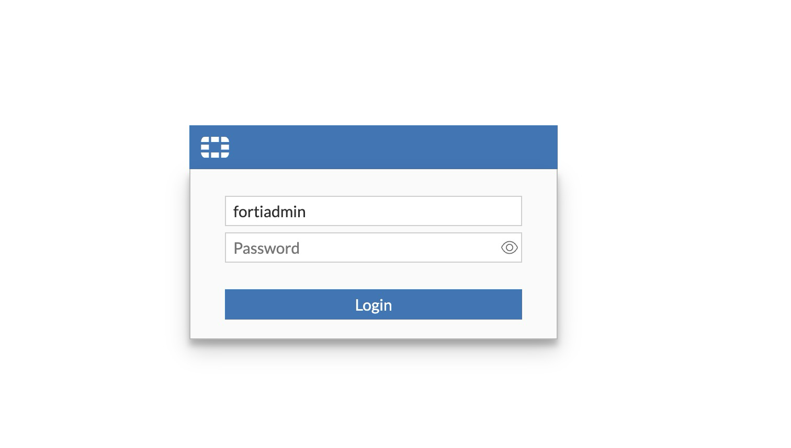
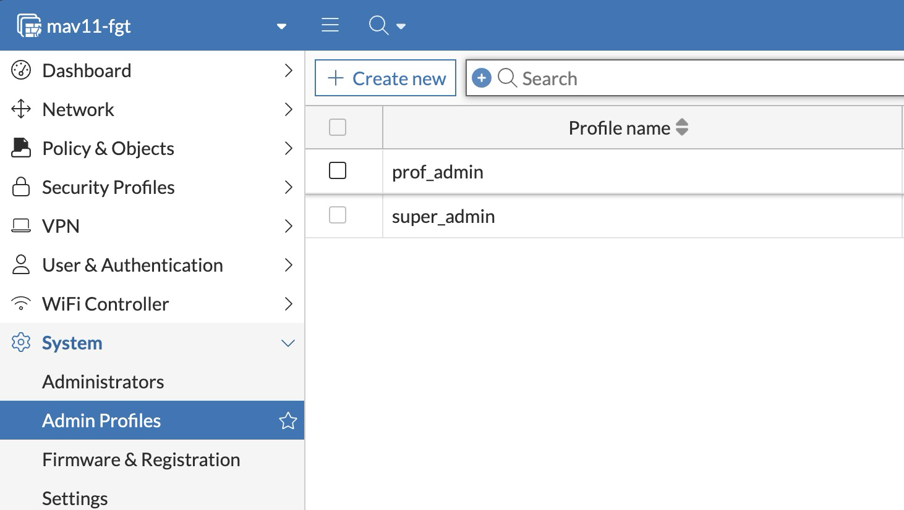
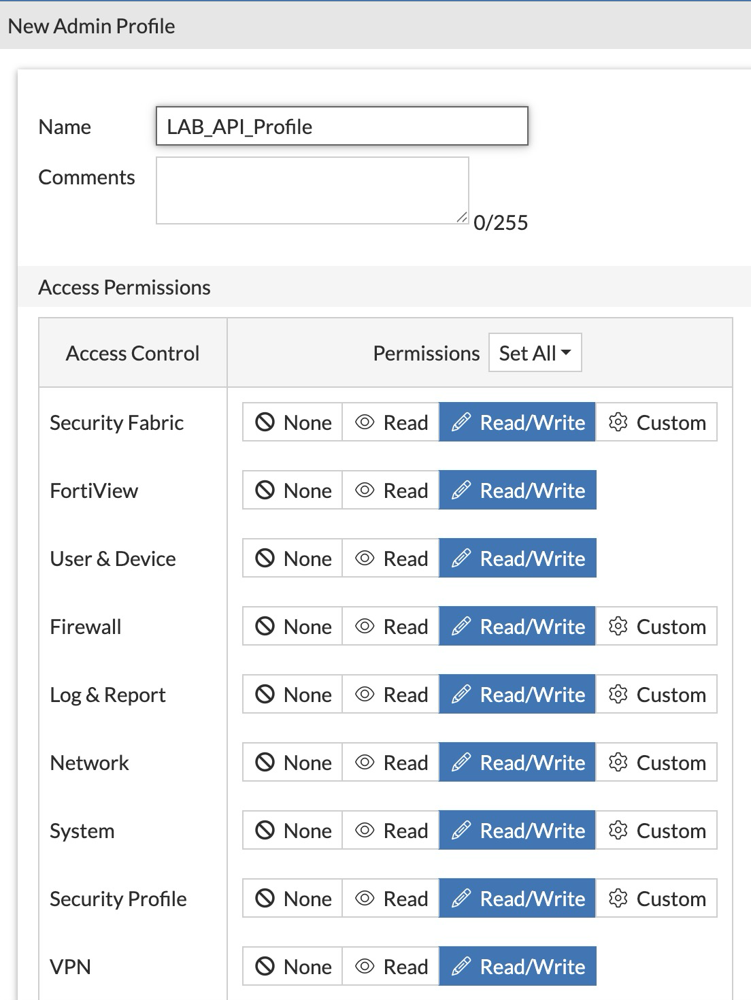
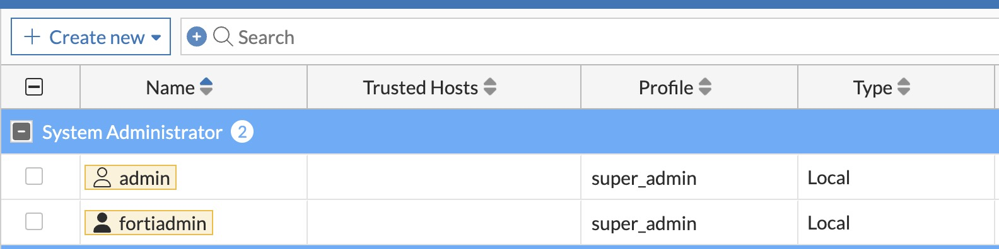
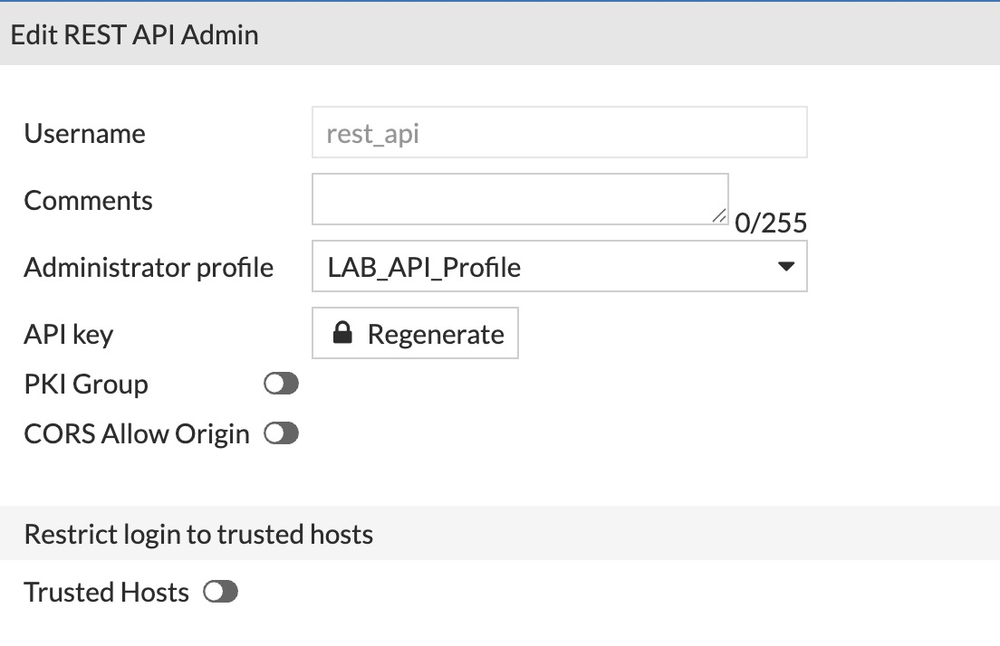
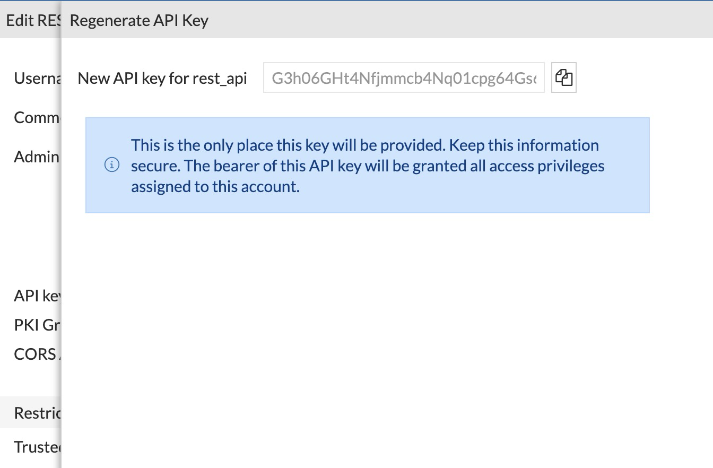

# Lab 1: Base Deployment & API Token Setup

## Lab Description

In this lab, you will deploy the FortiGate VM and create the REST API token the lab automation tool will use. By the end of this lab, FortiGate will be online and ready for the rule-generation, traffic, analysis, and cleanup workflow in Labs 2–5.

> **FortiAnalyzer is optional.** The active workshop path (Labs 1–5) does not require FortiAnalyzer — `phase3_traditional` reads policy hit counts directly from FortiGate's monitor API, and the AI analysis in Lab 4 reads only local JSON files. If your scope is FortiGate-only, skip the appendix at the end of this lab.

## Objectives

- Deploy FortiGate with basic interface configuration.
- Create a dedicated REST API administrator on FortiGate, restricted to Linux Host A.
- Configure the lab tool's `config.yaml` with the new token and verify connectivity.

## Time to Complete

Estimated: **30–40 minutes** (add ~30 minutes if you complete the optional FortiAnalyzer appendix)

---

# Exercise 1: Deploy the FortiGate VM

> **Hypervisor access, deployment image, and initial admin credentials will be provided separately by your instructor.** This exercise picks up *after* the FortiGate VM is powered on and you have console access.

1. Deploy the FortiGate VM using your preferred hypervisor (VMware/VirtualBox/KVM), or use the pre-deployed VM provided for the session.

2. Open the console and log in with the credentials provided by your instructor.

3. Set a new admin password when prompted.

4. Configure the three interfaces used by the lab — `port2` (inside, where Linux Host A connects and where the GUI/API are reached from), `port1` (outside, toward Linux Host B), and `port3` (out-of-band management):

```
   config system interface
       edit port2
           set ip 192.168.1.4/24
           set allowaccess ping https ssh http
       next
       edit port1
           set ip 10.10.0.4/24
           set allowaccess ping
       next
       edit port3
           set ip 172.16.0.4/24
           set allowaccess ping https ssh
       next
   end
```

   > Linux Host A reaches the FortiGate GUI/API on `port2` (`192.168.1.4`). `port3` (`172.16.0.4`) is the dedicated out-of-band management interface — used by FortiAnalyzer over the management network if you complete the optional FAZ appendix.

5. From your workstation, open a browser and navigate to `https://192.168.1.4` and confirm the FortiOS GUI loads.

> **(optional — FAZ)** If you want to also explore FortiAnalyzer log analytics, see the appendix at the end of this lab. FortiAnalyzer is **not required** for the rule-optimization workflow.

---

# Exercise 2: Create the REST API Token for Lab Automation

## Task 1: Create a Dedicated Administrator Profile on FortiGate

Before creating the API user, define what it is allowed to do.

1. Log in to the FortiGate GUI at `https://192.168.1.4`.

   

2. Go to **System → Admin Profiles**.

   

3. Click **Create New** to build a profile specifically for the lab script. Name it `Lab_API_Profile`.

4. Under **Access Control**, locate the **Firewall** area and set it to **Read/Write**.

   > This permission is required for the script to create, modify, and delete firewall policies.

   

5. Click **OK** to save the profile.

---

## Task 2: Create the REST API Administrator on FortiGate

1. Go to **System → Administrators**.

   

2. Click **Create New → REST API Admin**.

   

3. Assign the profile created in Task 1: select `Lab_API_Profile`.

4. Ensure **PKI Group** is not required (leave it disabled unless your environment uses certificate-based authentication).

5. **Leave "Restrict login to trusted hosts" disabled** for this lab.

   > **Note:** In a production environment you would normally enable trusted hosts and pin the source IP (e.g. `192.168.1.100/32`) to prevent token reuse from other hosts. We skip it here to simplify the lab — if your FortiGate has a default trusted-hosts policy that blocks the API call, that's the first thing to check when troubleshooting Phase 1.

6. Click **OK** to save.

---

## Task 3: Generate and Save the FortiGate API Token

1. After clicking **OK**, FortiOS displays the generated API token.

   

2. **Copy this token immediately and store it securely.** The token is displayed only once and cannot be retrieved later. If lost, you must generate a new one.

3. Keep the token available — you will paste it into `config.yaml` in Task 4 below.

---

## Task 4: Configure the Lab Tool

1. On Linux Host A, navigate to the lab directory:

```bash
cd ~/ruleTrafficGenerator
```

2. Copy the example config file:

```bash
cp config.yaml.example config.yaml
```

3. Open `config.yaml` in a text editor and fill in the following values:

   - `fortigate.host` — set to `192.168.1.4` (FortiGate `port2` inside interface, reachable from Linux Host A)
   - `fortigate.inside_interface` — leave as `port2`
   - `fortigate.outside_interface` — leave as `port1`
   - `fortigate.api_token` — paste the token generated in Task 3

> **(optional — FAZ)** Only fill the `fortianalyzer:` block if you completed the FortiAnalyzer appendix. Leave it commented out otherwise — the lab tool will skip Phase 4 FAZ cleanup automatically when the block is absent.

4. Save the file.

5. Install Python dependencies:

```bash
python3 -m venv .venv
source .venv/bin/activate
pip install -r requirements.txt
```

6. Verify connectivity by running a dry-run of Phase 1:

```bash
python3 main.py rules --count 10 --dry-run
```

Expected output (your address-pool size and per-type counts will vary by a couple of units; the FortiGate IP echoes whatever you set in `config.yaml`):

```
Generating 10 rules (dry_run=True)...
────────────────────────── Phase 1 — Rule Generation ───────────────────────────
Target rule count : 10
FortiGate         : 192.168.1.4
VDOM              : root
Interfaces        : port2 (inside) → port1 (outside)
Dry run           : True

Building address pool...
  Address objects  : 46

Generating policy objects...
  Total policies generated : 10
  Clean                    : 2
  Shadow                   : 1
  Duplicate                : 1
  Subnet overlap           : 1
  Service overlap          : 1

Rules saved to lab_output/generated_rules.json

DRY RUN — skipping FortiGate API push.

Phase 1 complete.
  Total generated : 10
```

A successful dry-run writes `lab_output/generated_rules.json` and prints the summary above. Nothing is pushed to FortiGate yet — that happens in Lab 2 Exercise 1.

---

# Appendix (Optional): FortiAnalyzer Integration

FortiAnalyzer is **not required** for any lab in the active path. Complete this appendix only if your scope includes FortiAnalyzer log analytics or you want to demo FAZ NLQ / custom datasets in Lab 2.

## A.1: Deploy FortiAnalyzer

1. Deploy the **FortiAnalyzer** VM.
2. Assign the management IP `172.16.0.5/24`.
3. Complete the initial setup wizard.
4. Apply the FortiAI Assist license (System Settings → FortiAI Assist License) if you have one.

## A.2: Register FortiAnalyzer with the Security Fabric

1. On FortiGate, go to **Security Fabric → Settings**, enable Security Fabric, and set FortiAnalyzer (`172.16.0.5`) as the log forwarding target.
2. On FortiAnalyzer, accept the device authorization request and verify logs are received under **Log View**.

## A.3: Create a FortiAnalyzer REST API Token

1. Log in to the FortiAnalyzer GUI at `https://172.16.0.5`.
2. Go to **System Settings → Administrators → Create New → REST API Admin**.
3. Assign read permissions for log and report access.
4. Copy and save the token.

## A.4: Add FortiAnalyzer to `config.yaml`

Uncomment the `fortianalyzer:` block in `config.yaml` and fill in `host`, `api_token`, and `adom`. With this block present, `main.py cleanup` will purge `LAB-TEST-2025` log entries from FortiAnalyzer in Phase 4.

> When the appendix is complete, the corresponding optional steps in Lab 2 (Exercises 3–5) and Lab 3 (Exercise 6) become available — these were intentionally cut from the active workshop path because none of them are needed by the rule-optimization analysis.